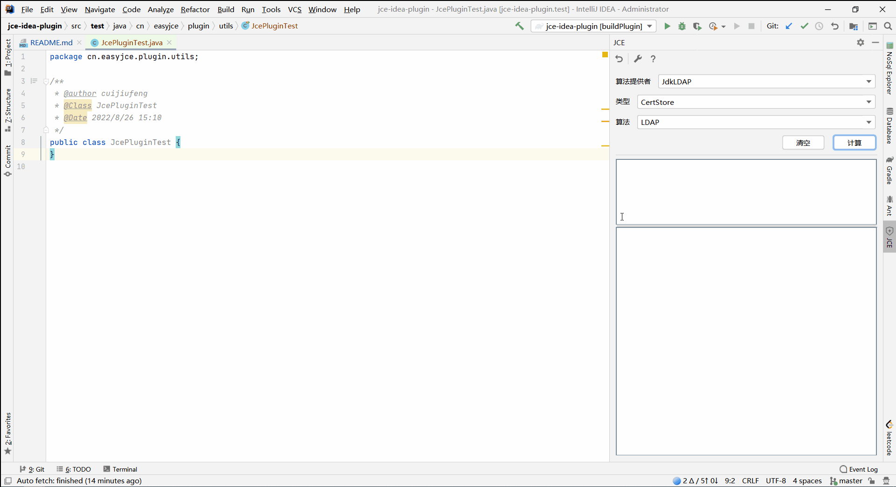
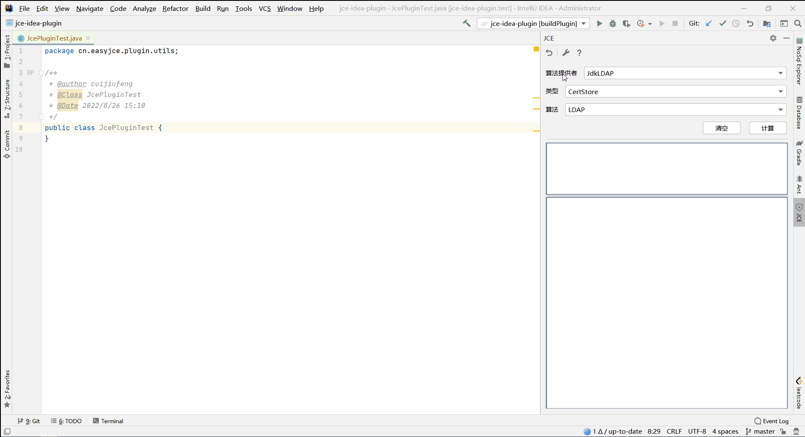
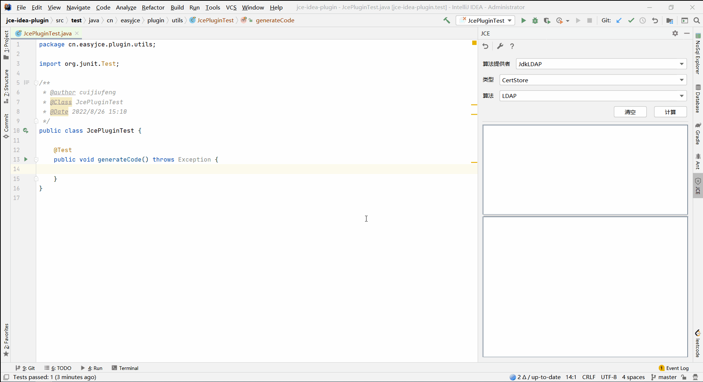

# Jce Idea Plugin #

----------

# 概述 #

这是一个idea插件学习工程，插件内容是java jce知识。

> 1. 插件提供了一个基本的工具面板，包含哈希，加密，签名，验签等计算。
> 2. 插件提供了一部分生成的代码的功能，包含生成哈希，加密，签名，验签等java代码块。

# 开发环境 #

`IntelliJ IDEA 2020.1.2 Ultimate`

# 功能说明 #

> - 随机数计算、代码生成
> - 哈希计算、代码生成
> - 对称、非对称密钥生成、代码生成
> - 对称、非对称加解密计算、代码生成
> - 签名、验签计算、代码生成
> - 极少的关于X509证书的功能，KeyStore,CertificateFactory等

# 教程说明 #

### 一、ToolWindow使用 ###

> 动图示例
> 
>
> 说明文档
> ```
> 1. 上部分选择框会列出当前java环境中的provider、type、algorithm
> 2. 中间部分ui组件是因为部分操作会需要填写一些参数
> 3. 以及下面包含一个数据输入框、数据输出框
> ```

### 二、插件配置 ###

> 动图示例
> 
>
> 说明文档
> ```
> 1. 可配置输入输出的编码
> 2. 支持扩展外部的provider
> 3. 记录历史的添加记录(历史添加记录右键删除，双击再次添入)
> ```

### 三、代码生成 ###

> 动图示例
> 
>
> 说明文档
> ```
> 1. 可生产一些jce的代码
> 2. 生成代码的编码暂只支持Hex
> ```